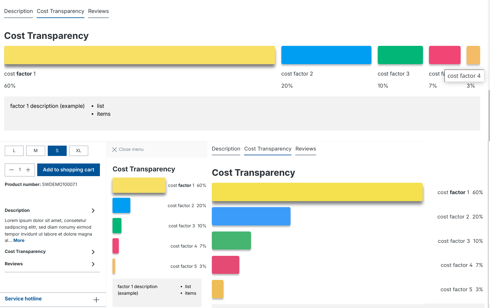
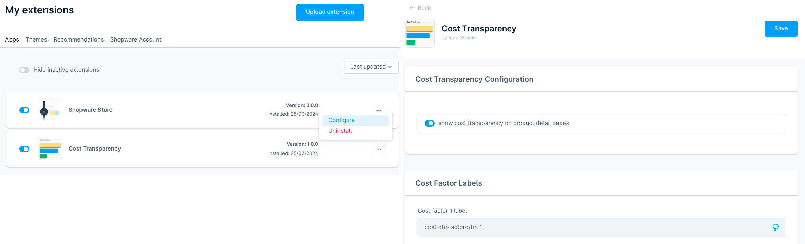
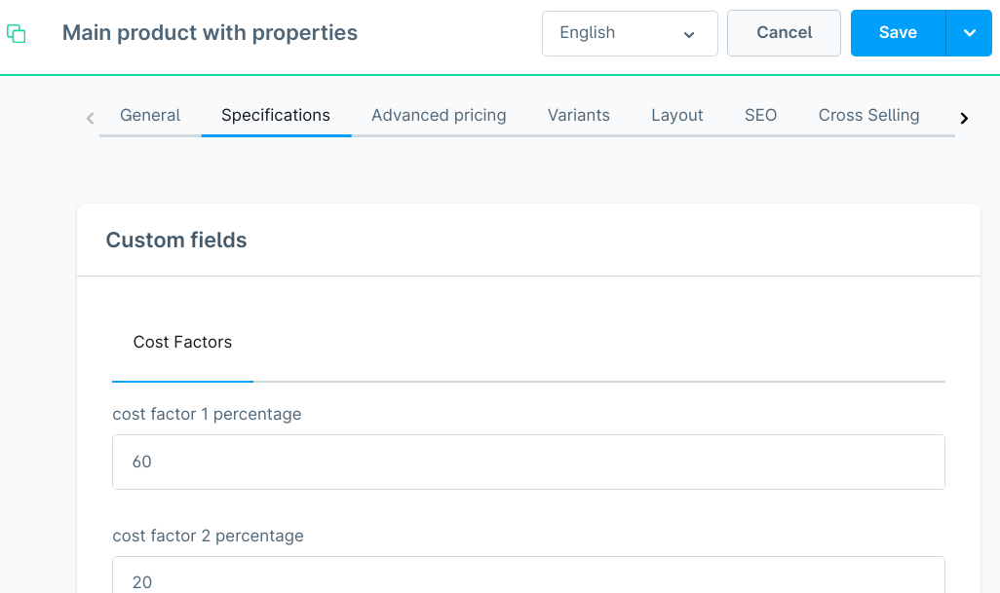

# Cost Transparency for Shopware 6

Inspired by potential customers' requirements and based on [Ingo Steinke](https://www.ingo-steinke.com/)'s [Shopware 6 Theme/Plugin Development Template](https://github.com/openmindculture/IngoSDev6CertPrep), [IngoSCostTransparency (`sw-IngoSCostTransparency`)](https://github.com/openmindculture/sw-IngoSCostTransparency) is a free and open-source extension for Shopware 6 that adds optional additional product details
as custom fields with responsive and accessible graphic percentage display on the product details.

Colors default to theme colors but can be modified by overwriting custom CSS properties.
Label captions can be configured in the extension configuration.

Short and long descriptions in German and English, and descriptive screenshots for the extension marketplace can be
previewed in [marketplace-descriptions-and-screenshots.html](./marketplace-descriptions-and-screenshots.html)

The content of the images/screenshots must be in English.

TODO: add a more specific purpose / use case and detailled instructions for installation, usage, and test.

## Cost Transparency Display in the Storefront

The layout is responsive and accessible. Mobile content will be displayed off canvas like the built-in description and reviews tabs. Tablet and mobile views show column rows, while wide desktop screens show columns. Captions of small columns will be shortened. The full caption is available in a title tag. Simple HTML markup is possible in captions, like using bold tags or list items.

## Configuration

To configure the plugin's labels and visibility, open the Administration and go to "My extensions". In the plugin's context menu (three dots or a similar icon), click on "configure". This should open the configuration page where you can toggle the global visibility ("show cost transparency on product detail pages") and edit labels and descriptions that will be used for all products where cost transparency data is available.

## Editing Custom Product Fields

Custom fields can be found an edited in the "Specifications" tab of each product.

## Usage, Notes, and Caveats

In the basic plugin version, up to five different cost factors can be defined per product, using the labels defined in the extension settings. If any values are set, an additional data visualization tab will be shown on the product details  page using a bar chart with percentage sizes. Please note: using multiple values below 10% might compromise readability.  It is possible to use HTML in the description blocks for each cost factor.

Data visualization might deviate from the precise percentages and may vary depending on screens, browsers, and operating systems. Visual output can also vary due to other reasons like Shopware versions, settings, and other plugins. Screenshots in the documentation and in the Shopware marketplace predate the official plugin release and might differ from the output in users' storefronts.

Future/premium plugin options:
- adjust colors and animations
- add more global cost factors
- add per-product cost factors/labels
- override cost factor descriptions per product
- select adjustment methods to improve low value readability

### Custom Fields and Localizable Snippets

Labels are translatable snippet strings e.g.

- label: string snippet `ingos.costTransparency.costFactorLabel01`

Values are custom fields stored in and read from the built-in customFields JSON array using the productRepository.

The basic plugin version uses the following five percentage values per product:

- value: integer `product.customFields.ingos_cost_transparency_percentage_01`
- value: integer `product.customFields.ingos_cost_transparency_percentage_02`
- value: integer `product.customFields.ingos_cost_transparency_percentage_03`
- value: integer `product.customFields.ingos_cost_transparency_percentage_04`
- value: integer `product.customFields.ingos_cost_transparency_percentage_05`

## Compatibility and Contribution

### Initial Release 1.0, March 2024

The storefront has been tested with the lastest major browsers, including Chrome, Firefox, Edge, and Safari, on desktop and mobile devices. Chromium, Vivaldi and Opera have also been tested successfully. The basic functionality should, but is not guaranteed, to work in other browsers like Internet Explorer and older Safari versions. The plugin has been tested with and released for Shopware 6.6, and it is probably backwards compatible with Shopware 6.5 for which it had initially been developed.

### Contribution

You can open issues and pull requests [on GitHub](https://github.com/openmindculture/sw-IngoSCostTransparency).

## Development

### Dockware Development Environment

Thanks to [dasistweb](https://www.dasistweb.de/), the Docker-based [dockware](https://docs.dockware.io/) containers provide a useful alternative to Shopware's
nixOS/flex/[devenv-based approach](https://developer.shopware.com/docs/guides/installation/devenv.html). The setup is based on the lastest dev image. We don't need no parent project
container repository anymore! `custom/plugins` is now mounted to the project `src` directory as recommended in the
[dockware example files on GitHub](https://github.com/dockware/examples).

### Start the Shopware Development Container

- `docker-compose up -d`

### Open the Storefront or Administration in a Browser

- http://localhost/
- http://localhost/admin (default credentials: admin:shopware)
- http://localhost//adminer.php (Server: 127.0.0.1, not localhost; database: shopware, root:root)

### Enter the Container Shell

- `docker exec -it shopware bash`

You will start in the Shopware project root `/var/www/html` where you can type console commands like
`bin/console plugin:create foobar`
to create a new plugin structure.

### Install Symfony Profiler

Install development tools, if they are not already pre-installed, like the Symfony Profiler:

`composer require --dev symfony/profiler-pack`

### Ensure File Permissions

New or copied content might not have the required permissions yet.
We might need to grant them expicitly by a command like

`sudo chmod -R ugo+rw src` (outside the container) or

`chmod -R ugo+rw custom/plugins`

#### Useful Console Commands

- `bin/console cache:clear`
- `bin/console plugin:refresh`
- `bin/build-storefront.sh`

### Stop the Container

- `docker-compose stop`

### Remove the Container

- `docker-compose down -v` (-v will remove created volumes)

### Update Shopware version by updating Dockware

- `docker pull shopware/dev`

## Logfile Locations

### Shopware Logs in Dockware

- `/var/www/html/var/log`

#### System Logs in Dockware

- `/var/log`

### Shopware Platform Source Code in Dockware

- `/var/www/html/vendor/shopware`

- TODO: mounting this as a secondary volume broke the installation.

- Workaround to see the shop source in the IDE: check it out into another, git-ignored, directory:

- `git clone https://github.com/shopware/shopware.git sw_platform_src`

- then "mark directory as" -> "sources root"

### Extension Export and Verification

Last but not least, you can build an exportable zip archive file to upload into a shop backend or Shopware's extension
marketplace.

There is an optional Shopware CLI that is not included in Dockware. You can get it from
[sw-cli.fos.gg](https://sw-cli.fos.gg) and use the `extension` command to build a theme file:

- `shopware-cli extension zip MyTheme`

The `--disable-git` to "use the source folder as it is" will include ignored files like the `vendor` folder and might
result in a zip file of > 60 MB that you would not want to distribute as a plugin! If we use git, we should explicitly
specify which tag or commit hash to check out, e.g. `--git-commit string 0.9.0` but this does not work inside the
container before configuring git, as the `shopware-cli` expects a respository with no additional settings (like our
dockware configuration) around it, and creating an ad-hoc respository below the existing one can cause new problems
like a fatal "dubious ownership in repository" error.

Pragmatically, we could delete the `vendor` directory before creating the zip distribution.
- `rm -rf custom/plugins/IngoSCostTransparency/vendor/`
- `shopware-cli extension zip custom/plugins/IngoSCostTransparency/ --disable-git --release --output-directory custom/plugins/dist_tmp`

Now we created the file `custom/plugins/dist_tmp/IngoSCostTransparency.zip` which is visible as
`src/dist_tmp/IngoSCostTransparency.zip` outside the container and could be moved to `dist`:
- `sudo mv src/dist_tmp/* dist` to commit it in this development repository.

### Official Testing Environment and Checklist

Specific validation rules are listed in the official plugin quality guidelines checklist:

https://developer.shopware.com/docs/resources/guidelines/testing/store/quality-guidelines-plugins/

To do after every update:
- validate the plugin against the checklist (manually)
- run all available validations, checks and audits (e.g. using `shopware-cli` which obsoletes the `FroshPluginUploader`)
- build an updated release file inside the development container (see above)
- stop the development container
- run the testing container (see below)
- upload and install the release file in the testing container
- repeat all manual test steps and ensure that the documentation matches the actual behavior
- uninstall, reinstall and re-test the plugin (twice, with or without "delete all data")

There is an official testing environment built with Docker, used by Shopware
for validating plugins. Their setup includes some of the typical gotchas like subdirectory paths and a nonstandard
storefront language (Dutch). It always uses the latest 6.x Shopware release.

- `docker run --rm -p 80:80 -e VIRTUAL_HOST=localhost ghcr.io/shopwarelabs/testenv:6.X.X`

If we want to retain and claim backward compatibility, we must repeat the test with alternative versions,
e.g. by using Dockware Docker tags to rebuild our development environment. 