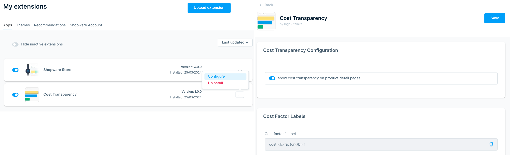

# Screenshots and Videos (Preview)

## Overview

 

## How to Install and Use the Shopware Cost Transparency Extension (Video)

https://www.youtube.com/watch?v=vshTiNyi8EI

## Fields Editor

 

## Configuration

## Description (German)

Visit https://store.shopware.com/de/ingos57544164693/kostentransparenz.html for the latest version!

### Details

- Verfügbar in: Englisch, Deutsch
- Zuletzt aktualisiert: 18. Juli 2025
- Veröffentlicht: 2. Mai 2024
- Version: 2.0.0
- Inklusive: Alle Updates

### Highlights

- Preistransparenz schon vor Inkrafttreten des Lieferkettengesetzes
- Einfache Integration in die bestehende Storefront
- Keine Programmierkenntnisse notwendig
- Keine versteckten Kosten
- 100% quelloffene Software

### Features

- Responsives und handyfreundliches Layout
- Barrierefreier, semantischer Quellcode
- Möglichkeit zur Verwendung von HTML-Markup in Titeln und Beschreibungen
- Sichtbarkeit in der Storefront abschaltbar, um Dateneingabe zu vereinfachen
- Farben können über CSS-Variablen (Custom Properties) angepasst werden

### Über die Erweiterung

Die Kostentransparenz-Erweiterung erweitert die Produktdetailseite um eine Registerkarte zur Visualisierung der Kostenfaktoren eines Produkts. Dadurch können wir unseren Kunden zeigen, wohin genau ihr Geld fließt, um Vertrauen aufzubauen unsere Nachhaltigkeitsversprechen mit Fakten zu belegen. Die Registerkarte wird angezeigt, wenn für ein Produkt Informationen zur Kostentransparenz verfügbar sind.

Kostenfaktoren und deren detaillierte Beschreibungen können für jede Sprache konfiguriert werden. Sie können HTML verwenden, um Text in Fettschrift zu formatieren oder eine Liste mit Features hinzuzufügen. Jedes Produkt kann bis zu fünf Kostenfaktoren haben. Wenn der Text zu lang für die Anzeige ist, wird er abgeschnitten, wird aber dank des Title-Attributs bei Mouse-Over angezeigt und von Screenreadern vorgelesen. Beim Anklicken oder Antippen eines Faktors wird der detaillierte Beschreibungstext darunter angezeigt.